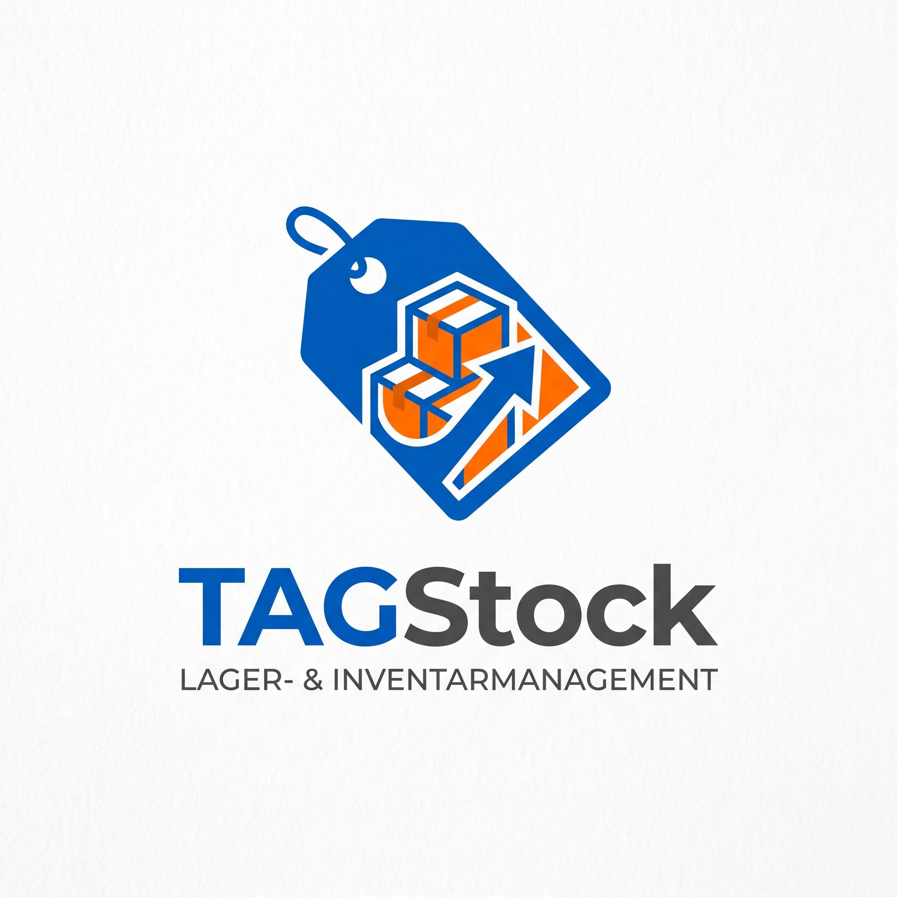

<p align="center">
  
</p>

# TagStock

Native Android-App (Java) zur Lagerverwaltung mit Barcode-, QR-Code- und
NFC-Erfassung. Kein WebView, keine Webanwendung – reines Android-SDK mit Views,
Room und CameraX.

Dazu gehört ein **optionaler Server** (`server/`) für mehrere Geräte: gemeinsamer
Bestand, Teams mit Rollen, Leih-Anfragen und die Artikelbilder – mit eigener
**Oberfläche im Browser**, um den Bestand auch ohne Handy zu pflegen. Ohne
Server läuft die App vollständig allein auf dem Gerät.

| Ich will … | Hier entlang |
|---|---|
| die App installieren oder aktualisieren | [UPDATE.md](UPDATE.md) |
| den Server auf Unraid einrichten | [server/INSTALL-UNRAID.md](server/INSTALL-UNRAID.md) |
| wissen, was der Server kann | [server/README.md](server/README.md) |
| sehen, was sich geändert hat | [changelog/](changelog/) |

## Funktionen

### Bestand
- Ein Artikel hat **genau einen Status**: vorhanden, nicht vorhanden, verliehen,
  verbraucht oder ausgelagert. Keine Stückzahlen.
- Felder: Bezeichnung, Beschreibung, Kategorie, **Standort** und **Lagerort**
  (Regal, Fach, Kiste), Kennung, Bild, Rückgabedatum und Scan-Warnung.
- Die Zahlenleiste oben zeigt die Verteilung nach Status und filtert auf
  Fingertipp. Dazu Suche, Kategorie- und Standortfilter, kombinierbar.
- Banner für **überfällige** Ausleihen und für Artikel, die zu lange nicht
  gescannt wurden (Warnschwelle je Artikel: halbjährlich, jährlich, alle zwei
  Jahre oder nie).
- **Mehrfachauswahl**: Status setzen, Standort ändern, Etikettenbogen als PDF.

### Kennungen und Scannen
- Je Artikel eine Kennung – NFC-Tag oder Barcode/QR –, **eindeutig** im Bestand.
  Ist sie vergeben, zeigt die App, zu welchem Artikel sie gehört.
- **Barcodes** (EAN-8/13, UPC-A/E, Code 39/128, ITF, PDF417, Aztec, Data Matrix …)
  und **QR-Codes** über die Kamera (CameraX + ML Kit, arbeitet offline).
- **NFC-Tags** parallel über den Reader-Mode: gelesen werden Tag-UID und, falls
  vorhanden, der NDEF-Inhalt. Leere Tags lassen sich aus der Detailansicht
  beschreiben.
- Drei Betriebsarten: **einzeln** (Treffer öffnen), **sammeln** (Liste aufbauen
  und gemeinsam buchen) und **Dauerscan** (jeder Treffer wird sofort als gesehen
  gebucht). Taschenlampe und manuelle Eingabe als Rückfallebene.
- Ein unbekannter Code führt direkt ins Formular – mit der Kennung schon drin.
- **Handelsnummern werden geprüft, ohne Netz:** Prüfziffer nach GS1 sowie Art
  und Herkunft der Nummer (EAN-13, UPC-A, Buch, Pfandmarke, hausinterner
  Nummernkreis). Tippfehler fallen damit sofort auf.
- Auf Wunsch schlägt der Server zu einer Handelsnummer den **Produktnamen**
  nach und bietet ihn beim Anlegen an (*Einstellungen → Produktdaten
  nachschlagen*, standardmäßig aus). Gefragt wird der Server, nicht der
  Anbieter – so bleibt ein Zugangsschlüssel dort, und jede Nummer geht
  höchstens einmal nach draußen.

### Detailansicht
Status und Standort in einem Schritt wechseln, QR-Code des Artikels, die
Standort-Historie und das vollständige Änderungsprotokoll mit Namen. Aus dem Menü:
bearbeiten, **Etikett** und **Leihbeleg** als PDF, NFC-Tag beschreiben, mit
Server eine **Ausleihe anfragen**, löschen.

### Kategorien
Frei pflegbar, mit eigener Reihenfolge; ein neues Team startet mit acht
Vorgaben. Hängt die App an einem Server, ändern nur **Admins und Lageristen**
die Liste – und zwar dort, damit alle Geräte dieselbe haben.

### Sicherung
- **JSON-Export** über den System-Dateidialog: vollständiger Bestand samt
  Kategorien und Protokoll, wieder einlesbar (ergänzend oder ersetzend).
- **CSV-Export** für die Tabellenkalkulation.
- Bilder bleiben außen vor: ohne Server liegen sie auf dem Gerät, mit Server auf
  ebendiesem.

### Mit Server: Team, Rollen, Abgleich
Unter *Einstellungen → Server* trägst du die Adresse ein, meldest dich an und
legst ein Team an oder trittst per Einladungscode einem bei.

| Rolle | Darf |
|---|---|
| `admin` | alles, dazu Mitglieder und Rollen verwalten |
| `lagerist` | Bestand und Kategorien pflegen, Anfragen entscheiden |
| `mitglied` | lesen und Ausleihen anfragen |

- **Abgleich** per Ziehen in der Bestandsliste oder auf Knopfdruck: eigene
  Änderungen hoch, fremde herunter. Bei Doppeländerungen gewinnt der jüngere
  Zeitstempel; Löschungen kommen als Merkmal mit.
- **Ohne Netz geht die Arbeit weiter.** Was offline angelegt oder geändert wird,
  merkt sich die App und überträgt es selbst, sobald wieder eine Verbindung
  besteht – auch wenn die App inzwischen geschlossen wurde (WorkManager mit
  Netzbedingung, dazu ein Durchlauf alle drei Stunden als Sicherheitsnetz). In
  den Servereinstellungen steht, wie viel noch wartet.
- **Artikelbilder** liegen auf dem Server. Die App verkleinert eine Aufnahme,
  lädt sie beim Abgleich hoch und hält auf dem Gerät nur einen
  Zwischenspeicher.
- **Anfragen**: Mitglieder fragen eine Ausleihe an, Lageristen entscheiden; eine
  Zusage setzt den Artikel auf verliehen.
- **Mitglieder**: Admins sehen alle Konten des Teams, ändern Rollen und
  entfernen Konten. Wer selbst gehen will, verlässt das Team an derselben Stelle.

### Oberfläche im Browser

`http://<server-ip>:8080/` zeigt dieselben Daten wie die App: Bestand mit Suche
und Filtern, Artikel anlegen und bearbeiten, Bilder, Kategorien, Mitglieder,
Anfragen und der Bereich *System* mit Version und bereitliegenden App-Fassungen.
Gescannt wird weiterhin mit der App – Kennungen lassen sich im Browser von Hand
eintragen. Das **erste angelegte Konto betreut den Server** und sieht alle Lager.

Einrichtung des Servers: [`server/README.md`](server/README.md), Schritt für
Schritt für Unraid: [`server/INSTALL-UNRAID.md`](server/INSTALL-UNRAID.md).

## Aktualisieren

Ausführlich in [UPDATE.md](UPDATE.md). Kurz:

- **Server:** Am einfachsten in der Oberfläche unter *System* – ein Knopf
  sichert die Datenbank, lädt die neue Fassung und startet neu; startet sie
  nicht, nimmt der Server wieder die vorherige. Sonst `sh server/update.sh`
  auf dem Host – holt den neuen Stand, sichert
  Datenbank und Bilder, baut das Abbild und startet den Container neu; erst wenn
  der Bau durchläuft, wird gewechselt. Eine bestehende Datenbank läuft weiter,
  fehlende Spalten ergänzt der Server beim Start selbst.
- **App:** Der Server hält die aktuelle **und** die vorherige Fassung bereit und
  holt sich neue Veröffentlichungen selbst (Lesezugriff aufs Projekt nötig). Auf
  dem Handy meldet sich *Einstellungen → Version* mit dem Änderungshinweis,
  sichert den Bestand und installiert nach Zustimmung. Der Rückweg auf die
  vorherige Fassung ist beschrieben – Android verlangt dafür ein
  Deinstallieren, deshalb landet die Datei im Download-Ordner.
- **Beide merken selbst, wenn es etwas Neues gibt.** Aktualisiert wird nie
  ungefragt.

### Versionen

`versionCode`/`versionName` stehen in `app/build.gradle`, die Serverversion in
`server/build.gradle`. Beim Ausliefern wird die Nummer hochgezählt – sonst sehen
die Geräte kein Update. Zu jeder Version gehört eine Datei unter
[`changelog/`](changelog/): je ein Ordner für App und Server, darin ein
Unterordner pro Jahr. `sh changelog/neu.sh app 2.1` legt sie an. Der Text landet
in der Veröffentlichung auf GitHub und im Aktualisierungsdialog auf dem Handy.

## Bauen

Der Build läuft bei jedem Push auf GitHub Actions
(`.github/workflows/android.yml`) – ohne lokale Android-Installation. Er legt
die APK als Artefakt `tagstock-debug-apk` am Lauf ab **und veröffentlicht sie**
unter einer Marke je Versionsnummer (`app-v2.0+2`), zusammen mit einer
`app.json` samt Änderungshinweis. Aus dieser Veröffentlichung bedient sich der
Server. Derselbe Lauf baut und testet auch den Server und startet sein
Docker-Abbild einmal zur Probe.

Lokal, mit JDK 17 und Android SDK (API 35):

```bash
./gradlew testDebugUnitTest    # Tests
./gradlew lintDebug            # Lint
./gradlew assembleDebug        # APK unter app/build/outputs/apk/debug/
./gradlew installDebug         # auf ein angeschlossenes Gerät
```

### Release signieren

Der Release-Build wird mit R8 verkleinert und signiert, sobald im Projektwurzel-
verzeichnis eine `keystore.properties` liegt (sie ist von der Versionierung
ausgeschlossen):

```properties
storeFile=/pfad/zum/schluessel.jks
storePassword=…
keyAlias=tagstock
keyPassword=…
```

Ohne diese Datei entsteht ein unsigniertes Release-APK.

## Tests

`app/src/test` läuft mit Robolectric auf der JVM:

- **MigrationTest** legt echte Datenbanken im Format von Version 1 und 2 an,
  führt die Migrationen aus und prüft das Ergebnis: aus dem Lager wird der
  Standort, aus der Ausleih-Historie das Protokoll, der erste Code wird zur
  Kennung. Room prüft dabei, ob das Schema exakt zu den Entities passt.
- **ArtikelLogikTest** rechnet Warnungen, Überfälligkeit, Suche und Filter nach.
- **SicherungTest** prüft JSON im Rundlauf und die CSV-Ausgabe samt Maskierung.
- **GtinTest** rechnet Prüfziffern nach und ordnet Präfixe zu.

Der Server hat eigene Tests unter `server/src/test`, die ihn hochfahren und die
Schnittstelle durchgehen (`cd server && ./gradlew test`).

## Datenmodell

Room, aktuell Version 3; Migrationen aus 1 und 2 sind hinterlegt, damit ein
Update den Bestand nicht verliert.

```
artikel    (id, serverId, teamId, rfidUid UNIQUE, name, beschreibung, kategorie,
            standort, lagerort, fotoPfad, bildUrl, status, verliehenAn,
            rueckgabeDatum, zuletztGescannt, scanWarnung, erstelltAm,
            geaendertAm, offen)
kategorien (id, serverId, teamId, name UNIQUE, reihenfolge)
protokoll  (id, serverId, artikelId, artikelName, aktion, alterWert, neuerWert,
            nutzer, zeitpunkt, offen)
```

`serverId` verbindet einen Datensatz mit dem Server, `offen` merkt sich, was noch
hochgeladen werden muss. Ohne Server bleiben beide leer.

## Projektstruktur

```
app/src/main/java/de/tagstock/
├── data/       Entities, DAOs, Migrationen, Repository, Abgleich
├── ui/         Activities, Fragmente, Adapter, ViewModel
└── util/       Scanner, NFC, Bilder, PDF, Sicherung, Serverzugriff, GTIN
server/         Eigenständige Serveranwendung (Spring Boot, SQLite, Docker)
changelog/      Was sich geändert hat, je Teil und Jahr
bilder/         Logo in voller Auflösung
UPDATE.md       Aktualisieren, Zurückgehen, Sicherungen
```

## Berechtigungen

- `CAMERA` – wird erst beim ersten Scan abgefragt; ohne Freigabe bleibt der
  NFC-Scan nutzbar.
- `NFC` – Geräte ohne NFC-Chip können die App trotzdem installieren.
- `INTERNET` – nur für den Serverzugriff; ohne eingerichteten Server ruft die App
  nichts auf. Unverschlüsselte Verbindungen sind ausdrücklich erlaubt, weil der
  Server im eigenen Netz HTTP spricht (`res/xml/netzwerk.xml`).
- `REQUEST_INSTALL_PACKAGES` – nur, um eine vom eigenen Server geladene
  Aktualisierung an den Systemdialog zu übergeben. Installiert wird sie erst
  nach Zustimmung dort.
- Für Sicherung und Bilder werden keine Speicherberechtigungen gebraucht: Dateien
  laufen über den System-Dateidialog, Aufnahmen liegen im privaten
  App-Verzeichnis.
